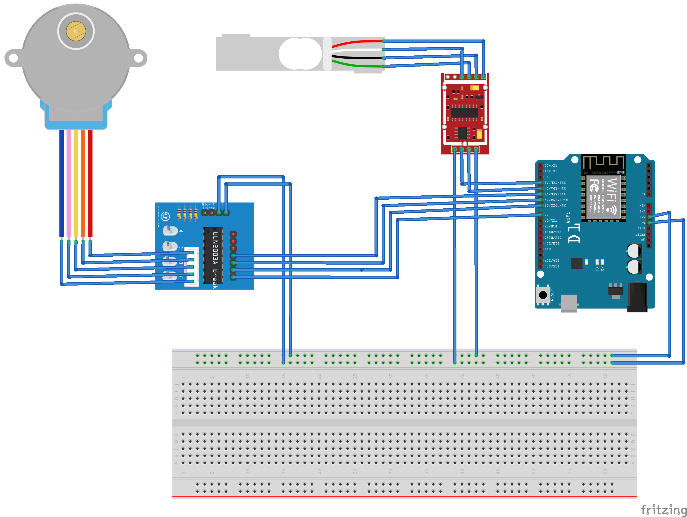

# Food dispenser

## Table of contents

* [Introduction](#introduction)
  * [Schematics](#schematics)
  * [Blynk Application](#blynk-application)
  * [Local Blynk Server](#local-blynk-server)
* [Prerequisites](#prerequisites)
* [Configuration](#configuration)
* [Build](#build)
* [Upload](#upload)
* [License](#license)

## Introduction

This project provides a simple - and maybe elegant - way to create a food dispenser for few things :
* [ESP8266](https://en.wikipedia.org/wiki/ESP8266) based board.
* *28BYJ-48* stepper with *uln2003* controller
* *HX711* controller with a load cell of your choice

As it is, this project cannot weight foods nor dispense them; it needs to work with [Blynk server](https://github.com/blynkkk/blynk-server) and application.  

### Schematics

### Blynk Application
1. Download Blynk application: http://j.mp/blynk_Android or http://j.mp/blynk_iOS
2. Touch the QR-code icon and point the camera to the code below
   
3. Enjoy the application ♥

### Local Blynk Server
You can setup manually your local server following [Blynk instructions](https://github.com/blynkkk/blynk-server) or  
use my [Blynk server repository](https://github.com/alekece/blynk-server) based on *docker-composer*.

## Prerequisites

* [arduino-cli](https://github.com/arduino/arduino-cli) is used to compile the source code and to upload it to the target board
* [cmake](https://cmake.org) is used as project builder with custom commands to ease the development
* [Blynk](https://blynk.io/) account.

The source code is written to be compatible first with WeMos D1 board but  
all ESP8266 based board with enough digital pins should work as well.

## Configuration 
**_cmake_** is building out of source then a dedicated `build` folder is **HIGHLY** recommanded.  

The project needs some mandatory private information to run properly. Those information should be given as **_cmake_** command line arguments :

* **BLYNK_TOKEN** - Your Blynk token; The token is available on your Blynk account
* **NETWORK_SSID** - Your local network SSID
* **NETWORK_PASSWORD** - Your local netword password associated to the SSID
* **ARDUINO_BOARD** - Your ESP8266 based module reference.
* **ARDUINO_PORT** - The port used by your ESP8266 based module.

As introduce earlier, the projet works as well with local Blynk server. To enable that feature you should provide extra **_cmake_** command line arguments :
* **SERVER_ADDRESS** - Your local Blynk server IP or domain.
* **SERVER_PORT** - Your local Blynk server port.

Run `make configure` to configure your project with the above information.

## Build

Run `make compile` to build the source code.

## Upload 

Run `make upload` to upload the project to your ESP8266 based card.  
Make sure it is connected to your computer and use the port given during the configuration step.

## LICENSE

Copyright © 2020 Alexis Le Provost. See LICENSE for details.
